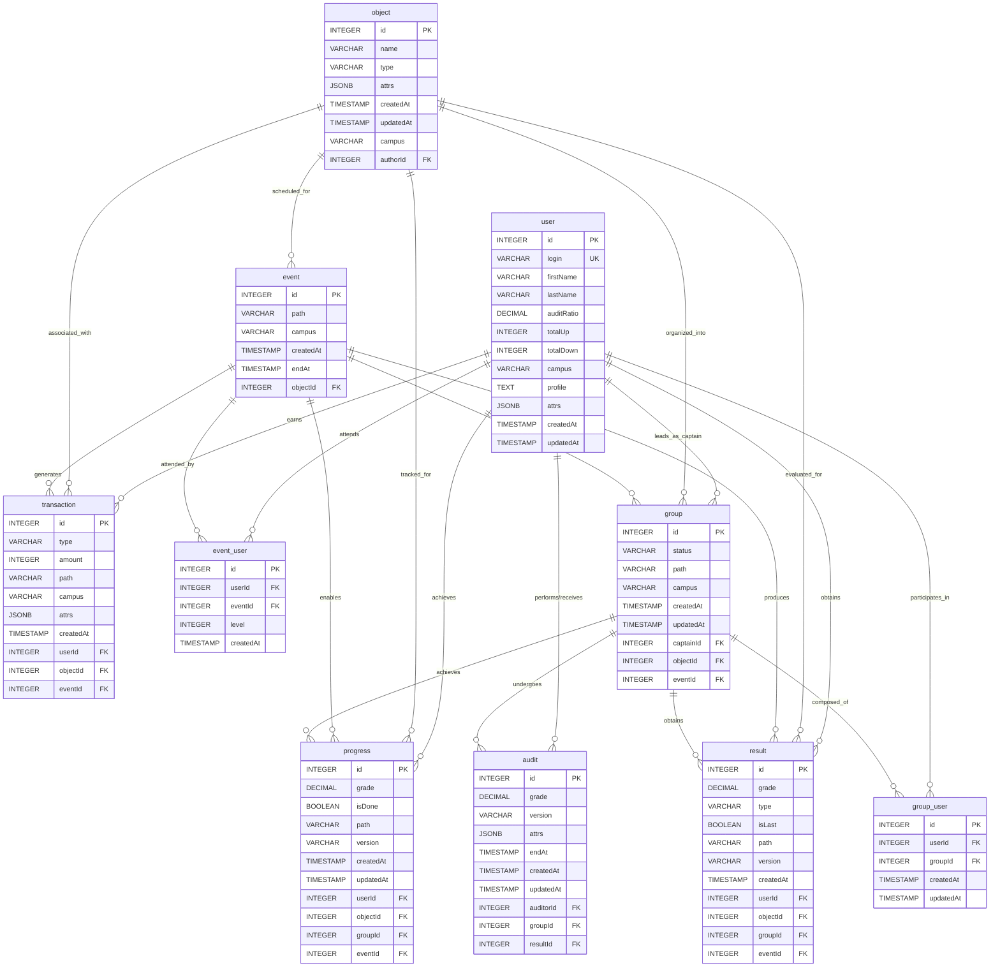

# 01 Dashboard 📊

[](https://opensource.org/licenses/MIT)
[](https://reactjs.org/)
[](https://vitejs.dev/)
[](https://tailwindcss.com/)
[](https://graphql.org/)
[](https://www.apollographql.com/docs/react/)
[](https://www.typescriptlang.org/)
[](https://vercel.com/)

---

<p align="center">
  <strong>01 Profile Dashboard</strong><br/>
  <em>Your personal command center for reboot01 learning analytics.</em>
</p>

<p align="center">
  Progress insights • XP analytics • Audit performance • Real-time sync • Beautiful charts
</p>

<p align="center">
  <a href="#-live">Live Demo</a> •
  <a href="#-what-makes-this-dashboard-special">Highlights</a> •
  <a href="#-the-technology-behind-the-magic">Tech Stack</a> •
  <a href="#-lets-get-you-set-up">Get Started</a> •
  <a href="#-screenshots">Screenshots</a>
</p>

<p align="left">
  
  
  
  
  
  
  
</p>

---

<details>
<summary><strong>Why this dashboard exists (read the story)</strong></summary>

Hey there! 👋 Welcome to the **01 Profile Dashboard** - your personal command center for tracking progress at reboot01. This isn't just another dashboard; it's a comprehensive tool that helps students like you understand their learning journey, celebrate achievements, and identify areas for growth.

Built with modern web technologies, this dashboard connects to the reboot01 platform to give you real-time insights into your coding education. Whether you're grinding through projects, participating in peer reviews, or climbing the XP leaderboard, this dashboard makes it easy to see exactly where you stand and where you're heading.

Think of it as your personal learning analytics platform - showing you not just what you've done, but helping you understand patterns in your progress, compare your performance with peers, and make data-driven decisions about your learning path.

</details>

## ⭐ Key Highlights

- **Clear learning analytics:** XP, projects, audits, and trends presented in a way that’s easy to read and compare over time.
- **GraphQL + Apollo Client:** Structured queries with caching and request batching to keep the dashboard responsive.
- **Responsive UI:** Works well across screen sizes, with charts and interactions that stay smooth.
- **JWT auth flow:** Token-based login with refresh handling and careful credential usage.
- **Vercel-friendly setup:** Simple deployment workflow with environment-based configuration.

---

## 🌐 Live

**Try it out now:** [01-dashboard-kappa.vercel.app/](https://01-dashboard-kappa.vercel.app/)

Experience the dashboard live with your reboot01 credentials!

---

## 📋 Table of Contents

- [Features](#-features)
- [Tech Stack](#-tech-stack)
- [Database Schema (ERD)](#-database-schema-erd)
- [Screenshots](#-screenshots)
- [Project Structure](#-project-structure)
- [Getting Started](#-getting-started)
- [Configuration](#-configuration)
- [Contributing](#-contributing)
- [License](#-license)
- [Author](#-author)
- [Acknowledgments](#-acknowledgments)

---

<details open>
<summary><strong>✨ What Makes This Dashboard Special</strong></summary>

### 🎯 Core Learning Analytics

**Deep Progress Insights**  
The dashboard aggregates your reboot01 activity using 30+ GraphQL queries—projects, audits, XP, and timelines—so you can see your progress in one place.

**XP Tracking (with useful breakdowns)**  
XP is broken down by project type, difficulty, and time range. This makes it easier to spot where most of your effort goes and how your activity changes over time.

**Audit Analytics**  
Track audit ratio and review activity to understand how you perform as both reviewer and reviewee. The goal here is clarity: what’s happening, when, and how it trends.

**Project Analysis**  
View completion patterns and outcomes across different project types and difficulty levels to highlight strengths and areas to improve.

### ⚡ Performance That Feels Instant

**Caching & re-use**  
Apollo Client caching helps reduce repeated fetching, so returning to pages feels faster.

**Request batching**  
Multiple queries are batched where possible to reduce network overhead and improve perceived speed.

**Graceful error handling**  
Common issues (timeouts, network drops) are handled with retries and readable messages instead of breaking the experience.

### 🎨 User Experience That Delights

**Authentication you can trust**  
JWT-based login with refresh handling keeps sessions stable without frequent re-logins.

**Charts that support the data**  
Custom SVG charts visualize XP trends, audit performance, and project patterns in a way that stays readable on different screen sizes.

**Responsive layout**  
Built mobile-first and designed to work comfortably on desktop, tablet, and phone.

**Real-time sync**  
As your reboot01 data changes (projects, XP, audits), the dashboard updates without needing a manual refresh.

**UI polish**  
Motion and micro-interactions are used sparingly to keep the interface clean while still feeling modern.

</details>

---

<details>
<summary><strong>🛠️ The Technology Behind the Magic</strong></summary>

This project uses a modern front-end stack and a GraphQL data layer to keep the UI responsive and the codebase maintainable:

### 🎨 Frontend Foundation
- **React 19**: Component-based UI with modern rendering features for smooth interactions
- **Vite**: Fast dev server and build tooling
- **Tailwind CSS**: Utility-first styling for consistent, responsive layouts

### 🔄 Smart Data Management
- **React Context API**: Simple, effective state management for user preferences and app-wide settings
- **Apollo Client**: GraphQL client for queries, caching, and synchronization

### 📊 GraphQL & Performance
- **Apollo Client Advanced Features**: Apollo's caching and query batching help keep data fresh and network usage efficient.

### ✨ Polish & User Experience
- **Framer Motion**: Motion and micro-interactions for UI polish
- **Custom SVG Charts**: We built our own chart components using SVG for crisp, scalable visualizations that work perfectly on any screen size
- **JWT Authentication**: Token-based auth with refresh handling
- **Lucide React Icons**: Beautiful, consistent iconography that scales perfectly and matches our design system

### 🚀 Deployment Ready
- **Vercel**: Deployment with environment variable configuration

 
</details>

---

<details>
<summary><strong>🗄 reboot01 Database Schema & GraphQL API (ERD + Queries)</strong></summary>

The reboot01 platform uses a PostgreSQL database with a comprehensive GraphQL API. This section explains the actual database structure, relationships, and how to query the data using GraphQL.

### 📊 Core Database Tables

Based on the actual GraphQL queries and database structure, here are the main entities:



### 🔑 Key Database Relationships

- **user** → **transaction**: Users earn XP and other rewards through transactions
- **user** → **progress**: Users achieve progress on projects and exercises
- **user** → **result**: Users obtain evaluation results from assessments
- **user** → **audit**: Users perform audits (as auditors) and receive audits (as auditees)
- **user** → **group_user**: Users participate in groups
- **user** → **event_user**: Users attend events and achieve levels
- **user** → **group**: Users can be captains of groups

- **object** → **transaction**: Objects (projects) are associated with XP transactions
- **object** → **progress**: Objects have progress tracking
- **object** → **result**: Objects have evaluation results
- **object** → **group**: Objects are organized into groups
- **object** → **event**: Objects are scheduled as events

- **event** → **transaction**: Events generate XP transactions
- **event** → **progress**: Events enable progress tracking
- **event** → **result**: Events produce evaluation results
- **event** → **group**: Events host groups
- **event** → **event_user**: Events have participants with levels

- **group** → **progress**: Groups achieve collective progress
- **group** → **result**: Groups obtain evaluation results
- **group** → **audit**: Groups undergo peer audits
- **group** → **group_user**: Groups consist of members

### 📝 GraphQL Query Examples

#### 🔐 Authentication Required
All queries require JWT authentication via Bearer token header.

#### 👤 Basic User Queries

**Get your own user data:**
```graphql
{
  user {
    id
    login
    firstName
    lastName
    auditRatio
    totalUp
    totalDown
    campus
  }
}
```

**Get specific user by ID:**
```graphql
query GetUser($id: Int!) {
  user_by_pk(id: $id) {
    id
    login
    firstName
    lastName
    auditRatio
  }
}
```

#### 💰 XP & Transaction Queries

**Get your XP transactions:**
```graphql
{
  transaction(where: {type: {_eq: "xp"}}, order_by: {createdAt: desc}) {
    id
    amount
    path
    createdAt
    objectId
    eventId
  }
}
```

**Get XP aggregates:**
```graphql
{
  transaction_aggregate(where: {type: {_eq: "xp"}}) {
    aggregate {
      sum {
        amount
      }
      avg {
        amount
      }
      count
    }
  }
}
```

#### 📊 Progress & Results Queries

**Get your project progress:**
```graphql
{
  progress(order_by: {createdAt: desc}) {
    id
    grade
    isDone
    path
    createdAt
    objectId
    groupId
  }
}
```

**Get your evaluation results:**
```graphql
{
  result(order_by: {createdAt: desc}) {
    id
    grade
    type
    path
    createdAt
    objectId
  }
}
```

#### 🔍 Audit Queries

**Get audits you've performed:**
```graphql
{
  audit(where: {auditorId: {_eq: YOUR_USER_ID}}) {
    id
    grade
    createdAt
    groupId
    resultId
  }
}
```

**Get audits performed on your work:**
```graphql
{
  audit(where: {result: {userId: {_eq: YOUR_USER_ID}}}) {
    id
    grade
    createdAt
    auditorId
  }
}
```

#### 👥 Group & Event Queries

**Get your groups:**
```graphql
{
  group_user {
    id
    groupId
    createdAt
    group {
      id
      status
      path
      captainId
    }
  }
}
```

**Get your event participation:**
```graphql
{
  event_user {
    id
    eventId
    level
    createdAt
    event {
      id
      path
      campus
    }
  }
}
```

#### 🏗️ Object/Project Queries

**Get available projects:**
```graphql
{
  object {
    id
    name
    type
    attrs
    campus
  }
}
```

### 🛠️ Using GraphiQL Explorer

To explore the API interactively:

1. **Access GraphiQL**: Visit `https://learn.reboot01.com/api/graphql-engine/v1/graphql` (requires login)
2. **Authentication**: Include your JWT token in the request headers
3. **Explore Schema**: Use the documentation explorer to see all available queries and types
4. **Test Queries**: Write and test queries in real-time
5. **View Results**: See exactly what data is returned

### 📋 Query Types Demonstrated

This project uses all required GraphQL query patterns:

- ✅ **Simple queries**: `user { id login }`
- ✅ **Nested queries**: `result { user { login } }`
- ✅ **Queries with arguments**: `user_by_pk(id: 123)`
- ✅ **Where clauses**: `transaction(where: {type: {_eq: "xp"}})`
- ✅ **Order by**: `progress(order_by: {createdAt: desc})`
- ✅ **Aggregations**: `transaction_aggregate { aggregate { sum { amount } } }`

### 🔗 Database Relations Documentation

For complete database structure and relations, see:
- [Database Structure](https://public.01-edu.org/docs/db/database-structure)
- [Database Relations](https://public.01-edu.org/docs/db/db-relations)

This ERD and query examples accurately reflect the reboot01 platform's actual database structure and GraphQL API capabilities.

 
</details>

---

## 📸 Screenshots

### Profile Dashboard
*A central hub showing an overview of user stats, recent projects, and activity.*

.png)
.png)

### Analytics & Statistics
*Detailed user profile with level progression, skills, and comprehensive statistics.*

.png)
.png)


---

## 🏗️ Project Structure

The project follows a feature-based architecture to ensure maintainability and scalability.

```
src/
├── assets/               # Static assets like images and SVGs
├── components/           # Reusable UI components (atomic design)
│   ├── charts/           # Data visualization charts
│   ├── dashboard/        # Components specific to the dashboard layout
│   └── ui/               # General-purpose UI elements (Button, Card, etc.)
├── config/               # Application configuration (e.g., motion variants)
├── contexts/             # React contexts for global state management
├── graphql/              # GraphQL client, queries, and type definitions
├── hooks/                # Custom React hooks for reusable logic
├── pages/                # Top-level page components
├── store/                # State management stores (e.g., Zustand, Redux)
├── styles/               # Global styles and CSS
├── types/                # TypeScript type definitions
└── utils/                # Utility functions and helpers
```

---

## 🚀 Let's Get You Set Up!

Getting started is straightforward.

### 📋 What You'll Need First

Make sure you have the following:
- **Node.js 18 or higher** - The runtime that powers modern JavaScript applications
- **npm** - Comes bundled with Node.js, handles package management
- **reboot01 account** - You'll need your login credentials to access the platform data

### 🛠️ Step-by-Step Installation

**1. Get the Code**
```bash
git clone <repository-url>
cd 01-dashboard
```
This downloads all the project files to your computer and navigates into the project directory.

**2. Fire Up the Development Server**
```bash
./run.sh dev
```
The script installs dependencies, prepares the environment, and starts the development server.

**3. Open Your Dashboard**
Point your browser to `http://localhost:5173` - that's where your dashboard lives during development.

**4. Sign In**
Log in using your reboot01 credentials. The dashboard fetches your data through the reboot01 API.

### 🎛️ Available Commands

The `run.sh` script is your command center for common tasks:

```bash
./run.sh dev          # 🚀 Start development server - your go-to for coding
./run.sh test         # ✅ Run all tests to ensure everything works
./run.sh build        # 📦 Create production build for deployment
./run.sh deploy       # 🌐 Deploy to hosting platform (when ready)
./run.sh help         # ❓ Show all available commands and options
```

**Pro tip**: During development, keep `./run.sh dev` running in one terminal. It automatically reloads when you make changes - no need to restart manually!

---

<details>
<summary><strong>🔧 Configuration & Customization</strong></summary>

The dashboard is designed to be highly configurable without touching the code. Everything is controlled through environment variables, making it easy to customize for different environments or personal preferences.

### 🛠️ Setting Up Your Environment

**1. Create Your Configuration File**
```bash
cp .env.example .env
```
This creates your personal configuration file based on our example template.

**2. Customize to Your Needs**
Open the `.env` file and adjust the settings. Don't worry - we've included helpful comments explaining what each variable does!

### 🎛️ Configuration Categories

Here's what you can customize:

**🔗 API & Data Connections**
- `VITE_API_BASE_URL` - Where your reboot01 API lives
- `VITE_GRAPHQL_ENDPOINT` - The GraphQL endpoint for data queries
- Control timeouts, retry logic, and connection settings

**🔐 Authentication & Security**
- `VITE_AUTH_TOKEN_KEY` - How we store your login tokens
- `VITE_AUTH_TOKEN_EXPIRY` - When tokens should refresh automatically
- Security settings to keep your data safe

**🎨 Look & Feel**
- `VITE_THEME_PRIMARY` - Your main brand color
- `VITE_THEME_SECONDARY` - Accent colors for highlights
- Dark/light mode preferences and custom styling

**⚡ Performance & Features**
- `VITE_FEATURE_ADVANCED_CHARTS` - Enable/disable advanced visualizations
- `VITE_FEATURE_REALTIME_UPDATES` - Control live data synchronization
- `VITE_CACHE_ENABLED` - Smart caching for faster loading
- `VITE_DEFAULT_PAGE_SIZE` - How many items to show per page

### 🌍 Environment Support

The dashboard works seamlessly across different environments:

- **Development** - Your local setup with hot reloading and detailed logging
- **Staging** - Test environment that mirrors production
- **Production** - Optimized for speed and reliability

Each environment can have its own configuration, so you can safely test changes before going live.

### 💡 Pro Tips

- **Start Simple**: Most users only need to set the API endpoints and authentication settings
- **Environment Variables**: Never commit your `.env` file - it contains sensitive information
- **Documentation**: Check the comments in `.env.example` for detailed explanations
- **Testing Changes**: Restart your dev server after configuration changes to see them take effect

 
</details>

---

## 🤝 Contributing

Contributions are welcome! Please follow these steps:

1.  Fork the repository.
2.  Create a new feature branch (`git checkout -b feature/your-feature-name`).
3.  Make your changes.
4.  Add tests if applicable.
5.  Commit your changes (`git commit -m 'Add some feature'`).
6.  Push to the branch (`git push origin feature/your-feature-name`).
7.  Submit a pull request.

---

## 📄 License

This project is licensed under the MIT License. See the [LICENSE.md](LICENSE.md) file for details.

---

## 👨‍💻 Author

**Sayed Ahmed Husain**
- Email: [sayedahmed97.sad@gmail.com](mailto:sayedahmed97.sad@gmail.com)

---

<details>
<summary><strong>🙏 Acknowledgments</strong></summary>

Thanks to the communities and tools below—this project relies on their documentation and open-source work.

### 🚀 **reboot01 Platform**
- **The Heart of Our Data**: Huge gratitude to the reboot01 platform for providing the comprehensive GraphQL API that powers all our analytics. Your well-structured database and thoughtful API design made building this dashboard an absolute pleasure.
- **Learning Environment**: Thank you for creating such an innovative coding education platform that challenges and inspires students worldwide.
- **Community**: The reboot01 community of learners, mentors, and staff who make the platform what it is today.

### 🎨 **Material Design 3 - Design Excellence**
Material Design 3 has been our guiding light for creating beautiful, accessible, and intuitive user interfaces. Here's how we've incorporated their principles:

#### **Core Design Principles Applied:**
- **Responsive Design**: Mobile-first approach ensuring the dashboard works flawlessly across all device sizes
- **Accessibility First**: High contrast ratios, proper focus states, and screen reader support
- **Consistent Spacing**: Using the Material Design token system for harmonious layouts
- **Meaningful Motion**: Subtle animations that enhance user experience without being distracting

#### **Material Design 3 Resources We Used:**
- **[Material Design Guidelines](https://material.io/design)** - The foundation of our design system
- **[Material Design Components](https://material.io/components)** - Inspiration for our UI component library
- **[Material Design Icons](https://fonts.google.com/icons)** - Consistent iconography throughout the app
- **[Material Color System](https://material.io/design/color)** - Our color palette and theming approach
- **[Material Typography](https://material.io/design/typography)** - Font scales and text styling
- **[Material Elevation](https://material.io/design/environment/surfaces)** - Surface and shadow system

#### **Design System Highlights:**
```
🎯 Design Tokens Used:
├── Color: Dynamic color system with light/dark themes
├── Typography: Display, headline, title, body scales
├── Spacing: 4px baseline grid system
├── Elevation: 5 levels of surface shadows
└── Shape: Rounded corners and border radius system
```

### ⚛️ **React Ecosystem**
- **React 19**: Thank you for pushing the boundaries of what's possible with modern React features
- **Vite**: Lightning-fast development experience that makes coding enjoyable
- **Framer Motion**: Beautiful animations that bring our interfaces to life
- **React Router**: Seamless navigation and routing capabilities

### 🎭 **UI/UX Libraries & Tools**
- **Tailwind CSS**: Utility-first CSS that enabled rapid, consistent styling
- **Lucide Icons**: Beautiful, customizable icon set that matches our design language
- **Radix UI**: Accessible, unstyled components that form the foundation of our UI

### 📊 **Data & GraphQL**
- **Apollo Client**: Intelligent GraphQL client with caching and performance optimizations
- **GraphQL**: The query language that makes our data fetching elegant and efficient
- **Hasura GraphQL Engine**: The powerful GraphQL API that serves the reboot01 platform

### 🛠️ **Development Tools**
- **TypeScript**: Type safety that catches errors before they reach production
- **ESLint & Prettier**: Code quality and consistency tools

### 🌟 **Open Source Community**
Thanks to the maintainers and contributors behind these open-source projects.

### 📚 **Learning Resources**
- **Reboot01 Documentation**: Comprehensive guides that helped us understand the platform
- **React Documentation**: Always reliable and well-written

### 💝 **Special Thanks**
To the reboot01 Bahrain campus community for the inspiration and feedback during development. Your enthusiasm for learning and coding excellence drives us to create better tools.

---

**Built with ❤️ for the reboot01 community.**

**⭐ If you find this project useful, please give it a star!**

</details>
